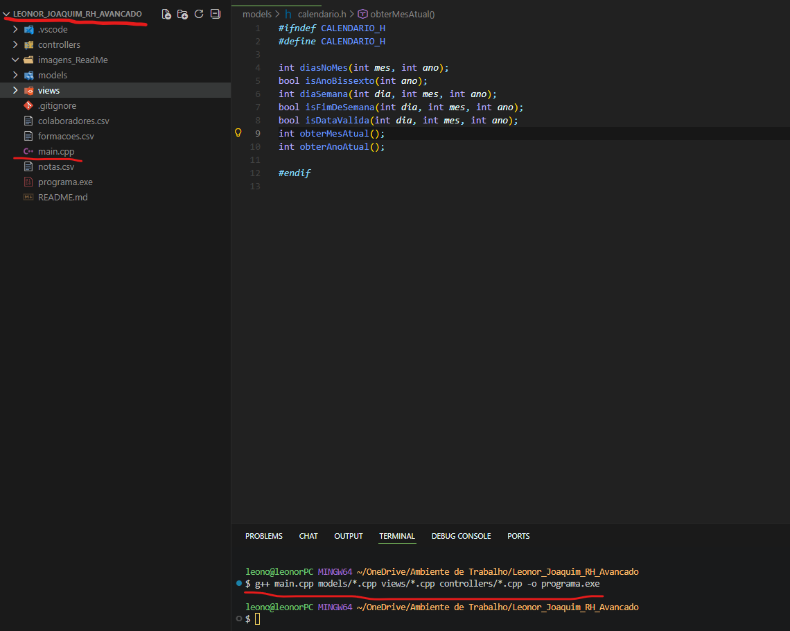
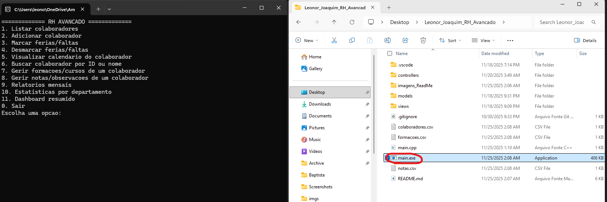

# Contexto

Para a UC 00607 o Professor solicitou a realização de outro mini sistema RH Avançado que envolvesse novos conceitos, mantendo os que já haviamos realizado:

1. Memória alocada dinamicamente (escolhi utilizar Vetores)
2. Leitura e escrita em Ficheiros, no caso escolhi CSV
3. Utilizar cifras para guardar nomes encriptados (utilizei a cifra de César)

Agora tivemos de acrescentar os seguintes:

1. Relatórios Mensais
    - Em que imprime, ou no terminal ou em ficheiro CSV, um relatório do mês para todos os colaboradores, em que mostre todos os dias de férias e faltas.
2. Procurar Colaborador:
    - No anterior podiamos procurar por nome, agora fazemos uma busca por Nome ou ID.
    - Mostra o calendário ATUAL, utilizando a biblioteca **chrono**
3. Estatisticas por departamento:
    - Por departamento, mostra o total de dias de férias ou faltas já tiradas.
    - No fim mostra qual o departamento com mais ausências
4. Marcação de Férias:
    - Pessoas do mesmo departamento podem marcar férias, mas avisa antes
5. Dashboard
    - Mostra todos os colaboradores, com as férias e faltas que têm e os dias restantes que têm de férias para tirar.
6. Formações e Cursos
    - Criação de uma estruturas com formações que têm a descrição e data da nota por colaborador.
        - Depois vai ter um submenu para criar, editar, remover ou listar notas de um colaborador.
7. Notas e Observações
    - Criação de uma estrutura com notas que têm o nome e data de conclusao por colaborador.
        - Depois vai ter um submenu para criar, editar, remover ou listar cursos de um colaborador.
8. Exportar Calendário e Relatório
    - Para csv

## Validações do Novo Programa

- Avisar se alguém já tem férias no mesmo dia

Avisa mas a operação continua pois não há nenhum return.

```cpp
if (tipo == 'F' && isConflitoFerias(listaColaboradores, colaborador, data)){
                std::cout << "Ja existe alguem do mesmo departamento com ferias nesse dia.\n"; }</pre>
```

- Mostrar o Mês e Ano Atual

Para mostrar o calendario atual no procurar Colaborador utilizei a biblioteca chrono para ir buscar informação ao sistema

```cpp
    auto agora = std::chrono::system_clock::now();
    std::time_t t = std::chrono::system_clock::to_time_t(agora);
    std::tm* data = std::localtime(&t);

    return data->tm_mon + 1;
```

- Gerar ID automaticamente

Para impedir ID's repetidos

```cpp
int idAtual = 0;
    for (size_t i = 0; i < listaColaboradores.size(); i++)
    {
        if (listaColaboradores[i].id > idAtual)
        {
            idAtual = listaColaboradores[i].id;
        }
    }

    return idAtual + 1;
```

## Como correr o programa localmente

No caso da minha máquina, utilizo o mingw para compilar, pelo que no terminal na mesma pasta onde se encontra o main.cpp corro o seguinte comando

`g++ main.cpp views/*.cpp models/*.cpp controllers/*.cpp -o main.exe`

`./main.exe`

Correr o programa no terminal do Vscode


Correr o programa com duplo clique no executável


## Organização do Programa

```markdown
Leonor_Joaquim_RH_Avancado
├─ colaboradores.csv                                                # Ficheiro com Colaboradores
├─ controllers                                                      # Controladores (Menus e RH)
│  ├─ menuAdicionarColaborador.cpp / menuAdicionarColaborador.h     # menu switch para adicionarColaborador
│  ├─ menuDashboard.cpp / menuDashboard.h                           # menu switch do Dashboard
│  ├─ menuEstatisticas.cpp / menuEstatisticas.h                     # menu switch para as Estatisticas
│  ├─ menuFormacoes.cpp / menuFormacoes.h                           # menu switch para as Formações
│  ├─ menuMarcarDia.cpp / menuMarcarDia.h                           # menu switch para marcações ou desmarcações
│  ├─ menuMostrarCalendario.cpp / menuMostrarCalendario.h           # menu switch para imprimir Calendario de um Colaborador
│  ├─ menuNotas.cpp / menuNotas.h                                   # menu switch para as Formações
│  ├─ menuPesquisarColaborador.cpp / menuPesquisarColaborador.h     # menu switch para pesquisar colaborador por id ou nome
│  ├─ menuPrincipal.cpp / menuPrincipal.h                           # menu switch principal
│  ├─ menuRelatorio.cpp /menuRelatorio.h                            # Funções do RH
│  └─ rh.h / rh.cpp                                                 # Lógica de gestão de colaboradores
├─ formacoes.csv                                                    # Ficheiro com formacoes dos colaboradores
├─ imagens_ReadMe
│  ├─ 1.png
│  └─ 2.png
├─ main.cpp
├─ models                                                           # Dados + Lógica interna
│  ├─ calendario.cpp / calendario.h                                 # Dados relacionados com imprimir calendário ou datas
│  ├─ cifra.cpp / cifra.h                                           # Lógica da Cifra de César para encriptar e desincriptar 
│  ├─ colaborador.h                                                 # Estruturas do Colaborador
│  ├─ dashboard.cpp / dashboard.h                                   # Imprime todas as férias e faltas de todos colaboradores
│  ├─ estatisticas.cpp / estatisticas.h                             # Por departamento
│  ├─ ficheiro.cpp / ficheiro.h                                     # Todos os dados relacionados com ficheiros CSV
│  ├─ formacoes.cpp / formacoes.h                                   # CRUD das formações
│  ├─ notas.cpp / notas.h                                           # CRUD das notas
│  └─ relatorio.cpp / relatorio.h                                   # Relatorio todos os colaboradores
├─ notas.csv                                                        # Ficheiro com notas dos colaboradores
├─ readme.md
└─ views                                                            # Interação com o utilizador
   └─ io.cpp / io.h
```

## Como funciona a encriptação

A Cifra escolhida foi a [Cifra de César](https://www.geeksforgeeks.org/ethical-hacking/caesar-cipher-in-cryptography/) (por sugestão do Professor) e funciona basicamente movendo no alfabeto o número de letras consoante a chave sugerida. Ou seja, se a chave for 2, a letra A passa a ser C e por aí diante. É uma encriptação mais simples que [XOR com HEX](https://www.geeksforgeeks.org/dsa/xor-encryption-shifting-plaintext/), mas serve o propósito para este projeto.

## Formato do Ficheiro CSV Colaboradores

`ID,NomeComCifra,AAAA-MM-DD,T,Departamento`

1. ID do Colaborador
2. Nome Com Cifra de César
3. Data Escolhida
4. Tipo - Pode ser Férias (F) ou Falta (X)
5. Departamento

## Formato do Ficheiro CSV Formaçoões

`id,nome,formacao,data`

1. ID do Colaborador
2. Nome Com Cifra de César
3. Nome da Formação
4. Data de conclusão

## Formato do Ficheiro CSV Notas

`id,nome,data,texto`

1. ID do Colaborador
2. Nome Com Cifra de César
3. Data da Nota
4. Descrição / Texto sobre o colaborador
